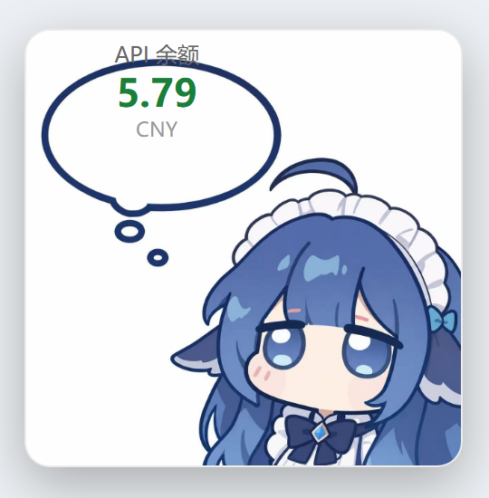

# DSH API Balance Widget

A dynamic **Cordis plugin** for **DeepSeek Harness** (DSH): shows your **DeepSeek API balance** in a floating widget at the **bottom-right corner** of the page, displayed on top of a custom background image inside the image's own dialog box. The balance label is **draggable** and **refreshes every 20 seconds**.



## Features

- 🖼️ Custom background image — the balance label floats over any local image (default: `D:\1234\...jpg`, configurable)
- 💰 Live balance — queries the official endpoint `GET https://api.deepseek.com/user/balance`, refreshes every 20 s
- 🖱️ Draggable label — grab the balance text and drop it anywhere inside the image (percentage-based, stays put when the image is resized)
- 📍 Fixed at the bottom-right of the page (registered in the root `shell.overlay` slot; never blocks clicks or scrolls away)
- 🔐 No secrets in the repo — the API key is read at runtime from the DSH credentials service (`DEEPSEEK_API_KEY`)

## How it works

```
┌──────────┐   balance/status (20s polling)    ┌─────────────────────────────┐
│  Browser │ ◄───────────────────────────────  │  DSH Host (dynamic plugin) │
│ (Client) │ ─── host.call ──────────────────► │  ├─ credentials.resolve(    │
│          │                                   │  │    'DEEPSEEK_API_KEY')    │
│ bottom-  │  balance/image (base64 data URL)  │  ├─ subprocess: node -e fetch│
│ right    │ ◄───────────────────────────────  │  │    api.deepseek.com/...   │
│ overlay  │                                   │  └─ fs.readBytes(IMAGE_PATH) │
└──────────┘                                   └─────────────────────────────┘
```

- **Balance request**: the dynamic plugin sandbox disables `fetch`, and Windows' bundled `curl` (schannel) TLS is unreliable on some machines, so the host shells out to a **Node child process** (Node ships its own OpenSSL/TLS stack) via the `subprocess` service.
- **Image transfer**: the host encodes the image as a **byte-exact base64** data URL for the browser. ⚠️ Note: the host's built-in `btoa` encodes *UTF-8 text* and must not be used for binary data — that was the root cause of the widget disappearing in early versions (see `bytesToBase64` in `plugin/host.js`).

## Install / Load

This is a dynamic Cordis plugin (defined in-process; no build step). In any DSH session:

1. Ask the AI assistant to define the plugin with the `cordis_define` tool:
   - `plugin/host.js` → `code.host`
   - `plugin/client.js` → `code.client`
   - suggested `pluginId` prefix: `blnc`
2. Run it with `cordis_run` (approve in the UI on first run).
3. The widget appears at the bottom-right of the page.

You can also paste the two files' contents to the assistant and ask it to define the plugin for you.

## Configuration

### 1. Background image (`plugin/host.js`, config section at the top)

```js
const IMAGE_PATH = 'D:\\1234\\3e8a47e3f5fe5e931f63bffce75cc04d.jpg'; // absolute path to your image
const IMAGE_DIR  = 'D:\\1234';                                        // directory of the image
```

### 2. Refresh interval (`plugin/client.js`, config section at the top)

```js
const REFRESH_MS = 20000; // milliseconds; the host cache TTL (TTL_MS in host.js) should stay slightly below this
```

### 3. Default label position (`plugin/client.js`, config section at the top)

```js
const DEFAULT_POS = { x: 30, y: 14 }; // percentage coordinates inside the image
```

### 4. API key

No code changes needed. Make sure the DSH credentials service provides `DEEPSEEK_API_KEY`
(usually in `~/.dsh/.credentials.yaml`, or exported in the launching environment).

## FAQ

| Symptom | Cause / Fix |
| --- | --- |
| Widget completely invisible (early versions) | Host `btoa` re-encoded the image bytes as UTF-8. Fixed with byte-exact base64; nothing to do now |
| Shows "DEEPSEEK_API_KEY not configured" | Add the key to `~/.dsh/.credentials.yaml` or export it |
| Balance not updating | Check network access to `api.deepseek.com`; look at the browser DevTools console and the run card diagnostics |
| Different balance source | Change `BALANCE_URL` and the parsing logic in `fetchBalance()` |

## License

[MIT](LICENSE)

## Disclaimer

This project is not affiliated with DeepSeek. It only uses DeepSeek's public API. Please comply with the [DeepSeek terms of service](https://platform.deepseek.com/) and applicable laws.
